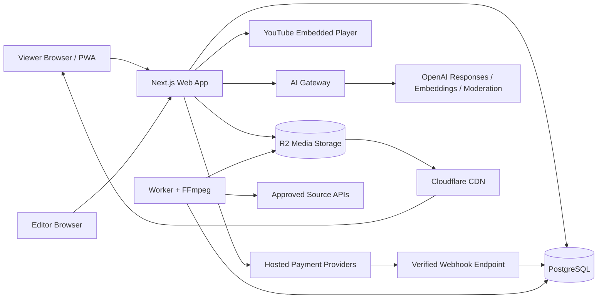

# System Architecture

## Architecture decision

Use a **modular monolith** with a separate background worker process.

This gives the speed of one codebase while keeping boundaries clear enough to split later.

## Recommended stack

### Application

- TypeScript
- Next.js
- React
- Tailwind CSS
- accessible component primitives
- PWA manifest and service worker
- server-rendered catalogue pages

### Database and auth

- PostgreSQL
- Supabase as the recommended managed starting point
- SQL migrations
- row-level access rules where useful
- PostgreSQL full-text search, trigram matching and pgvector

### Media

- Cloudflare R2 object storage
- Cloudflare CDN/DNS
- FFmpeg worker for self-hosted assets
- HLS.js or a maintained compatible player
- native MP4 playback for shorts
- YouTube privacy-enhanced embeds for approved external videos

### Background processing

MVP:

- PostgreSQL-backed jobs table;
- scheduled worker polling;
- retries and dead-letter status;
- one Docker worker with FFmpeg.

Later:

- managed queue;
- multiple workers;
- managed video service if operations justify it.

### Payments

- payment provider adapter;
- hosted checkout;
- PayFast Pakistan as the first recurring-capable provider to investigate;
- JazzCash and easypaisa as important local checkout options;
- entitlement engine independent of provider.

### AI

- OpenAI Responses API;
- embeddings for retrieval;
- moderation endpoint;
- server-side AI gateway;
- prompt registry;
- eval datasets;
- usage metering and quotas.

## High-level diagram



## Application modules

- identity;
- catalogue;
- editorial;
- media;
- ingestion;
- rights;
- playback;
- search;
- recommendations;
- payments;
- entitlements;
- AI;
- notifications;
- analytics;
- trust and safety;
- administration;
- audit.

Each module owns its service interfaces and database access functions. Do not let UI pages issue arbitrary database queries.

## Deployment topology

### MVP

- one small production web container;
- one small worker container;
- one managed PostgreSQL project;
- R2 bucket;
- Cloudflare DNS and CDN;
- one staging environment;
- GitHub Actions CI.

The web and worker may initially run on one low-cost VPS through Docker Compose or Coolify. Keep database and media storage managed.

### Environments

- local;
- preview/CI;
- staging;
- production.

Production data must never be copied into preview environments.

## API style

Use server actions or route handlers for first-party browser interactions and versioned REST endpoints where stable external or worker contracts are needed.

Examples:

```text
POST /api/v1/checkouts
POST /api/v1/webhooks/payfast
GET  /api/v1/catalogue
GET  /api/v1/content/:slug
POST /api/v1/playback/token
POST /api/v1/ai/query
POST /api/v1/studio/import
POST /api/v1/studio/media/uploads
```

## Caching

- static catalogue metadata: CDN cache with purge on publish;
- personalised home: short private cache;
- thumbnails: immutable cache;
- HLS segments: immutable cache;
- search: short result cache;
- AI answers: semantic or exact cache for safe reusable questions;
- entitlements: short server cache with immediate invalidation on payment events.

## Search progression

### Stage 1

PostgreSQL title, description, tag and alias search.

### Stage 2

Roman Urdu synonyms, typo tolerance and curated query aliases.

### Stage 3

Hybrid keyword and vector search.

Do not add Elasticsearch or Meilisearch before PostgreSQL search becomes a measured bottleneck.

## Observability

Capture:

- request traces;
- payment event IDs;
- content ID and playback source;
- player errors;
- worker job IDs;
- AI model, prompt version and token usage;
- admin actor ID;
- deployment version.

Never log payment credentials, complete mobile identity data or private AI conversation content without a clear retention policy.
