# Media and Streaming Plan

## Hosting modes

Jalwa must select playback based on rights, not convenience.

### 1. Official embed

Use for YouTube and other approved platforms.

- Store metadata and provider ID.
- Render the official player.
- Do not download or restream.
- Do not remove provider controls, branding or advertisements.
- Do not put free YouTube functionality behind a Jalwa paywall.
- Recheck availability regularly.

### 2. Self-hosted open-license

Use only after verifying:

- commercial use;
- redistribution;
- adaptation;
- attribution;
- share-alike obligations;
- relevant jurisdiction;
- third-party marks, people and music.

### 3. Jalwa-owned

Content commissioned, produced or contractually assigned to Jalwa.

### 4. Partner-hosted

Partner supplies a signed HLS URL or managed player under an agreement.

## Recommended MVP approach

### Shorts

For Jalwa-owned clips up to roughly 60–90 seconds:

- 9:16 master;
- H.264/AAC;
- 720 × 1280;
- web-optimised MP4 with `faststart`;
- poster image;
- WebVTT captions;
- byte-range delivery from R2 through Cloudflare;
- signed token for premium clips.

This is simpler and cheaper than generating multiple HLS renditions for every short.

### Long-form

For self-hosted content longer than roughly two minutes:

- HLS master playlist;
- 360p;
- 480p;
- 720p;
- optional audio-only rendition;
- four-to-six second segments;
- captions;
- poster and preview sprite;
- signed manifest access for premium.

Do not produce 1080p until source quality and audience demand justify it.

## Upload pipeline

```mermaid
flowchart LR
    E[Editor requests upload] --> S[Signed direct upload]
    S --> I[R2 incoming bucket]
    I --> J[Create processing job]
    J --> P[FFprobe validation]
    P --> V[Virus and policy checks]
    V --> F[FFmpeg transcode]
    F --> O[R2 processed bucket]
    O --> M[Manifest and metadata]
    M --> Q[Editorial playback QA]
    Q --> PUB[Publish]
```



## Object layout

```text
incoming/{upload-id}/source.ext
processed/{content-id}/{version}/master.m3u8
processed/{content-id}/{version}/360p/index.m3u8
processed/{content-id}/{version}/480p/index.m3u8
processed/{content-id}/{version}/720p/index.m3u8
processed/{content-id}/{version}/short-720.mp4
processed/{content-id}/{version}/poster.webp
processed/{content-id}/{version}/captions/ur.vtt
evidence/{rights-record-id}/...
```

## Access protection

### Free content

Public immutable CDN URLs are acceptable.

### Premium content

- browser requests a short-lived playback token;
- server validates entitlement;
- token is scoped to asset, user/session and expiry;
- Cloudflare Worker validates token before serving manifest or MP4;
- segment URLs inherit or carry the token;
- never expose raw origin credentials.

Signed URLs are not DRM. They deter casual sharing but cannot prevent screen recording. Do not promise studio-grade protection.

## Cost strategy

### Cheapest operational model

- use official embeds for most third-party long-form content;
- self-host Jalwa shorts and a limited open catalogue;
- R2 for storage and delivery;
- one FFmpeg worker;
- cap upload length and resolution;
- do not originate live streams.

Cloudflare R2 currently advertises no Internet egress charge and includes a small monthly free allocation, making it attractive for early self-hosted media. Cloudflare Stream is a managed alternative that includes encoding and bandwidth, priced by stored and delivered minutes. Use Stream when engineering and operational simplicity become worth more than self-managed transcoding.

## Example capacity planning

Assumptions:

- 1,000 shorts;
- average 60 seconds;
- average encoded size 12–18 MB;
- total storage approximately 12–18 GB;
- two images/caption files per short.

This is manageable on object storage. The more important cost driver is viewing, not catalogue size.

For HLS:

- 100 long videos;
- average 12 minutes;
- three renditions;
- storage depends on bitrate, not only duration;
- segment request volume can become high.

Measure:

- minutes delivered;
- cache hit rate;
- average bitrate;
- start time;
- buffering ratio;
- playback error rate.

## Shorts feed implementation

- use CSS scroll snap;
- keep only current, previous and next player mounted;
- prefetch metadata for several items but media for only the next item;
- pause offscreen video immediately;
- preserve mute preference;
- captions default on;
- record impressions only after meaningful visibility;
- record a view only after a defined watch threshold;
- never preload an endless feed.

## Live strategy

### MVP

- embed approved official YouTube live streams;
- poll allowlisted channels;
- show “Live Now” only when embeddable;
- remove the row after the event ends;
- store replay metadata if still available.

### Later

Only build Jalwa-originated live streaming when Jalwa owns the rights and has:

- encoder ingest;
- live transcoding;
- moderation;
- recording;
- concurrency planning;
- failover;
- rights controls;
- live operations staff.

## Media quality checks

Automated:

- playable duration;
- codec and container;
- dimensions;
- loudness;
- black frames;
- missing audio;
- corrupt segments;
- caption syntax;
- poster generation.

Human:

- title and thumbnail;
- audio intelligibility;
- Urdu caption quality;
- rights evidence;
- age rating;
- sensitive claims;
- source attribution.
