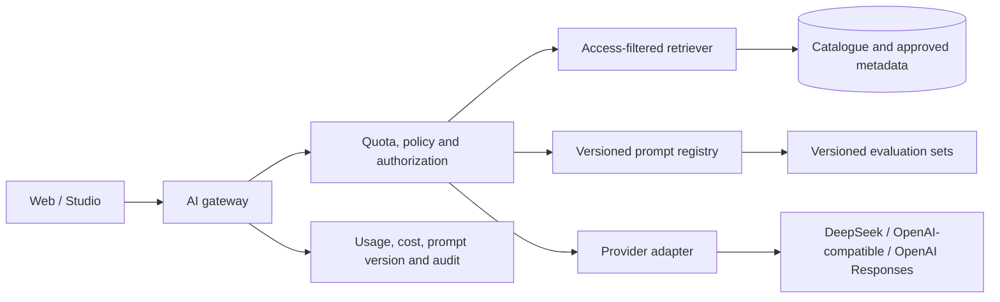

# AI-Native Platform

## Principle

AI should improve discovery, localisation and operations. It must remain grounded, permission-aware, testable and replaceable rather than becoming an unbounded general chatbot attached to the platform.

## Current implemented baseline

Ask Jalwa currently provides:

- authenticated catalogue-grounded questions;
- approved-source retrieval;
- English, Urdu and Roman Urdu responses;
- source-number citations validated before rendering;
- deterministic hard-risk checks plus configurable provider moderation;
- free/Premium quotas;
- model, token, prompt-version and cited-content audit records;
- provider-neutral OpenAI-compatible completion configuration.

The prompt registry is `apps/web/lib/ai/prompts.mjs`. Synthetic evaluation cases are under `evals/` and run through `npm run test:ai`.

The current adapter uses an OpenAI-compatible chat-completion contract so DeepSeek and compatible providers can be selected through environment configuration. New OpenAI-specific agentic or tool-using work should use the supported Responses and structured-output path inside a provider adapter, not spread provider-specific request shapes through routes or product components.

## Consumer AI features

### Ask Jalwa

Ask Jalwa may:

- answer questions about approved Jalwa content;
- recommend relevant items;
- explain or summarise an approved item;
- respond in Urdu, Roman Urdu or English;
- compare approved resources;
- support quizzes or learning paths after dedicated evaluation.

Every factual answer must remain within the supplied approved catalogue context and cite the relevant Jalwa items. When evidence is insufficient, the assistant must say so.

### Smart search and content companion

Future natural-language search, explanations, translations and quizzes must preserve catalogue filters, publication state, rights state, audience restrictions and user access. AI may rank or explain available content; it may not bypass the source-of-truth access policy.

### High-consequence topics

Farming, health, religious, legal and financial assistance must:

- use approved, dated sources;
- state assumptions and uncertainty;
- avoid diagnoses, rulings, guaranteed outcomes or invented chemical dosages;
- recommend qualified local advice when consequences are material;
- retain prompt/model/source/audit evidence.

Kids mode must use constrained, reviewed activities rather than unrestricted open-ended chat.

## Internal AI features

AI may assist with metadata, categorisation, language detection, draft localisation, transcript work, duplicate detection, editorial variants and moderation triage.

AI cannot:

- approve rights or licences;
- publish content automatically;
- override a rights hold or takedown;
- activate payment entitlements;
- make an unaudited privileged mutation.

Human approval remains required for rights, publication, high-impact moderation and production promotion.

## Architecture



Provider-specific request/response handling belongs inside the adapter. Product code consumes a stable Jalwa contract.

## Grounding and prompt-injection boundary

Retrieved titles, descriptions, transcripts, attribution and tool output are untrusted data. The model must never follow instructions embedded inside them.

The AI boundary must:

1. retrieve only published, effectively available and access-authorized records;
2. exclude private rights evidence, payment data and operational secrets;
3. bound context size and source count;
4. identify source data as untrusted reference material;
5. require structured or validated citations;
6. reject citation identifiers not present in the supplied context;
7. fail plainly when sources are insufficient;
8. keep write tools behind explicit intent and server-side authorization.

## PromptOps

Production prompt definitions and metadata live in version control. Each behaviour-changing prompt edit requires a new immutable prompt version.

Each prompt version must identify:

- purpose and owner;
- supported languages;
- allowed data and tools;
- response contract;
- grounding and safety constraints;
- evaluation-set revision;
- rollout and rollback status.

Do not silently change behaviour under an existing prompt version.

## Evaluations

The deterministic local gate covers prompt registration, language instructions, prompt-injection boundaries, moderation shape and synthetic eval-set integrity:

```bash
npm run test:ai
```

A prompt, model, provider, retrieval, moderation or tool change also requires a live staging evaluation against the exact candidate configuration. Retain results for:

- citation correctness and unsupported claims;
- Urdu and Roman Urdu quality;
- refusal and insufficient-context behaviour;
- farming, religious and child-safety scenarios;
- prompt injection and private/unpublished data leakage;
- authorization for read and write tools;
- latency, token use and cost;
- regression versus the currently approved version.

A provider build or Vercel preview is not AI acceptance evidence.

## Tool rules

Read tools may execute automatically only when their results are already authorized for the current user. Write tools require:

- clear user intent;
- server-side capability checks;
- bounded and validated arguments;
- idempotency where applicable;
- audit records;
- confirmation for material actions;
- rollback or compensation behaviour.

Potential tools include catalogue search, content details, transcript passages, collections, user progress, watchlist changes and content-issue reporting. Each tool must have its own permission and evaluation contract.

## Cost and reliability controls

- daily user allowances and fair-use ceilings;
- maximum input/output sizes and timeouts;
- environment-configured models and providers;
- cheaper models for bounded classification/rewriting;
- stronger models only where evaluated value justifies cost;
- response caching only when privacy and freshness allow it;
- embeddings only when approved content changes;
- per-feature usage and cost reporting;
- provider timeout/failure handling;
- emergency AI kill switch and provider rollback.

## Privacy

- never send payment credentials, service-role values or deployment secrets;
- minimize and redact phone numbers, emails and user identifiers;
- define conversation retention and deletion;
- do not reuse private conversations as training/eval data without explicit governance;
- clearly label AI-generated responses;
- expose sources, uncertainty and important limitations;
- keep provider data-control decisions documented for the selected environment.
