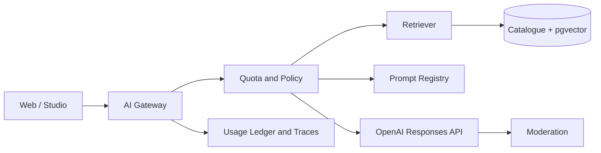

# AI-Native Platform Plan

## Principle

AI should improve discovery, localisation and operations. It must not become an ungrounded general chatbot attached to a media site.

## Consumer AI features

### Ask Jalwa

A catalogue-grounded assistant that can:

- answer questions about Jalwa content;
- recommend relevant items;
- explain a video or article;
- summarise in Urdu, Roman Urdu or English;
- generate a quiz;
- compare two approved resources;
- continue a learning path.

Every factual answer should cite Jalwa catalogue items.

### Smart search

- natural-language queries;
- Roman Urdu query understanding;
- semantic matching;
- filters preserved;
- direct answers only when grounded;
- fallback to normal results.

### Content companion

On a content page:

- “Explain simply”
- “Summarise”
- “Key points”
- “Translate”
- “Quiz me”
- “What should I watch next?”

### Kissan assistant

This is a high-consequence feature. It must:

- use only approved, dated agricultural sources;
- show region, crop and season assumptions;
- cite sources;
- avoid pretending to diagnose with certainty;
- recommend contacting local extension or qualified experts;
- route pesticide, veterinary and safety-critical questions to conservative responses;
- keep an audit trail.

### Kids mode

Do not expose open-ended AI chat to children in MVP. Offer constrained, pre-approved activities such as quizzes and explanations.

## Internal AI features

### Ingestion copilot

- extract metadata;
- suggest categories and tags;
- identify language;
- draft Urdu/Roman Urdu descriptions;
- produce chapter markers;
- flag missing rights fields;
- suggest age rating;
- detect duplicate or near-duplicate entries.

AI may flag rights risk but cannot approve a licence.

### Transcript and localisation

- speech-to-text;
- Urdu and English captions;
- Roman Urdu draft;
- human review before publication;
- terminology glossary.

### Editorial copilot

- title variants;
- synopsis;
- thumbnail copy;
- SEO metadata;
- collection suggestions;
- push/email copy;
- content gap analysis.

### Moderation

Use automated moderation for text and images, combined with policy rules and human escalation.

## Technical design



## OpenAI integration

Use the Responses API for new agentic and tool-using flows. Do not start a new implementation on the deprecated Assistants API.

Use:

- Responses API;
- structured outputs;
- function calling;
- embeddings;
- moderation;
- batch processing for offline catalogue tasks where appropriate.

Model IDs must be configuration, not hardcoded throughout the application.

## Retrieval architecture

1. split approved transcripts and articles into meaningful chunks;
2. store source content ID, language and timestamps;
3. generate embeddings after publication;
4. retrieve by keyword and vector similarity;
5. filter by rights, publication status, audience and user access;
6. send only the necessary context;
7. require structured citations;
8. validate cited IDs before rendering.

Never retrieve unpublished rights evidence or private payment data into consumer AI context.

## Tool functions

- `search_catalogue`
- `get_content_details`
- `get_transcript_passage`
- `get_collection`
- `get_user_progress`
- `save_to_watchlist`
- `create_quiz`
- `report_content_issue`

Read actions may run automatically. Write actions need clear user intent and server-side authorisation.

## Cost controls

- daily free-user allowance;
- higher premium allowance with fair-use ceiling;
- maximum output tokens;
- low-cost models for classification and rewriting;
- stronger models only for complex grounded answers;
- response caching;
- embedding only when content changes;
- batch catalogue enrichment;
- duplicate prompt suppression;
- per-feature cost reporting;
- emergency feature kill switch.

## AI product tiers

### Free

- limited Ask Jalwa requests;
- short summaries;
- basic recommendations.

### Premium

- larger request allowance;
- full content companion;
- quizzes and learning paths;
- multi-item comparison;
- saved study history.

Avoid the word “unlimited” unless an enforceable fair-use policy exists.

## PromptOps

Store prompts in version control:

```text
prompts/
├── consumer/ask-jalwa/
├── consumer/summarise/
├── consumer/quiz/
├── studio/metadata/
├── studio/moderation/
└── policies/
```

Each prompt version must specify:

- purpose;
- allowed tools;
- response schema;
- safety constraints;
- supported languages;
- test cases;
- owner;
- rollout status.

## Evaluations

Maintain eval sets for:

- citation correctness;
- Urdu quality;
- Roman Urdu quality;
- refusal behaviour;
- farming safety;
- religious sensitivity;
- child safety;
- recommendation relevance;
- prompt injection;
- hidden unpublished content leakage;
- cost and latency.

A model or prompt change may not reach production without passing the relevant eval suite.

## Privacy

- never send payment credentials;
- redact phone numbers and emails when unnecessary;
- provide conversation deletion;
- define retention;
- do not train custom systems on private user chats without explicit governance;
- clearly label AI-generated responses;
- show sources and uncertainty.
