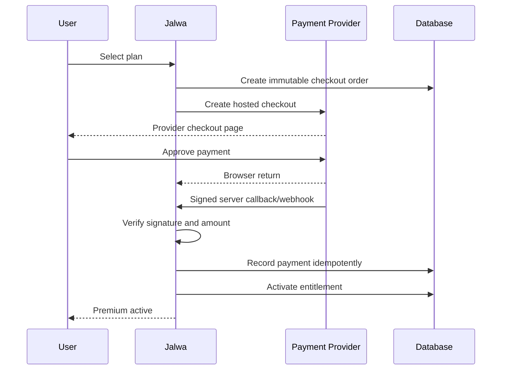

# Payments and Subscriptions

## Commercial model

Jalwa should use a subscription-like entitlement system even if the first payment provider only supports one-time checkout.

This separates access logic from payment limitations.

## Provider strategy

### Primary investigation: PayFast Pakistan

PayFast Pakistan publicly describes subscription and recurring-payment products. Confirm during merchant onboarding:

- API availability;
- card and wallet methods;
- recurring eligibility;
- tokenisation;
- webhook signing;
- refund API;
- settlement timing;
- fees;
- tax documentation;
- chargebacks;
- sandbox access.

### Secondary: JazzCash

Important for Pakistani reach. Public merchant material supports mobile account, cards and vouchers. Do not assume automatic recurring billing until the merchant agreement confirms it.

### Secondary: easypaisa

Important local wallet and online gateway. Treat recurring support as unconfirmed until documented in Jalwa's merchant contract.

### Fallback launch model

Sell:

- 30-day Premium Pass;
- 365-day Premium Pass.

Send renewal reminders and preserve the same product UX. Later, recurring providers can attach to the existing subscription and entitlement model.

## Hosted checkout

Use redirect or provider-hosted checkout. Jalwa must not collect raw card details.

## Payment state machine

```text
CREATED
→ PENDING
→ SUCCEEDED
→ FAILED
→ EXPIRED
→ REFUNDED
→ PARTIALLY_REFUNDED
→ DISPUTED
```

Subscription state:

```text
INCOMPLETE
→ ACTIVE
→ PAST_DUE
→ CANCEL_AT_PERIOD_END
→ CANCELLED
→ EXPIRED
```

Entitlement state:

```text
SCHEDULED
→ ACTIVE
→ EXPIRED
→ REVOKED
```

## Checkout sequence



## Critical rules

- never activate from query parameters on the return URL;
- verify provider signature;
- verify amount and currency;
- deduplicate provider events;
- store raw payload hash;
- allow safe retries;
- reconcile pending payments;
- record all manual corrections;
- use integer minor currency units;
- lock plan price into each order;
- do not alter historical payment records.

## Plan structure

### Free

No payment record.

### Premium Monthly

Recommended price experiment: PKR 299.

### Premium Annual

Recommended price experiment: PKR 2,999.

These prices require market testing and financial review.

## Benefit codes

Instead of scattering `isPremium` conditions, use benefits:

- `premium_catalogue`
- `jalwa_ads_free`
- `enhanced_quality`
- `ai_plus`
- `premium_collections`
- `early_access`
- `family_profiles`
- `offline_authorised`

A plan grants a set of benefits. Playback and UI check benefits.

## Refunds and support

Admin must support:

- search by checkout/order/transaction;
- resend receipt;
- see provider status;
- reconcile;
- grant temporary access;
- revoke fraudulent access;
- record refund;
- record reason;
- show audit history.

## Renewal

### Pass model

- reminder seven days before expiry;
- reminder one day before expiry;
- grace period optional;
- one-click new hosted checkout;
- no claim of auto-renewal.

### Recurring model

- explicit user consent;
- provider subscription reference;
- retry policy;
- cancellation;
- card/wallet update path;
- billing emails;
- failed payment state;
- grace period;
- webhook-driven period updates.

## Financial reporting

Daily:

- successful gross amount;
- refunds;
- failed payments;
- provider fees;
- net expected settlement;
- unmatched settlements.

Monthly:

- MRR-equivalent;
- new paid users;
- renewals;
- churn;
- average revenue per payer;
- gross margin after media and AI cost.
